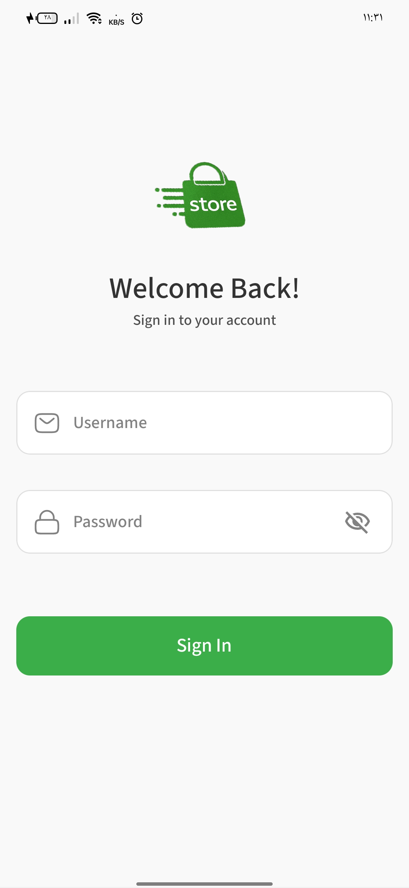
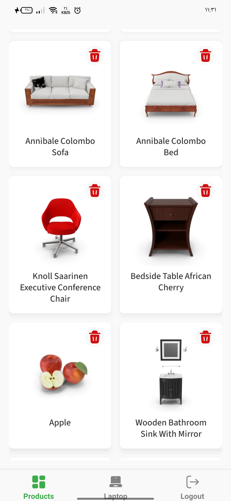
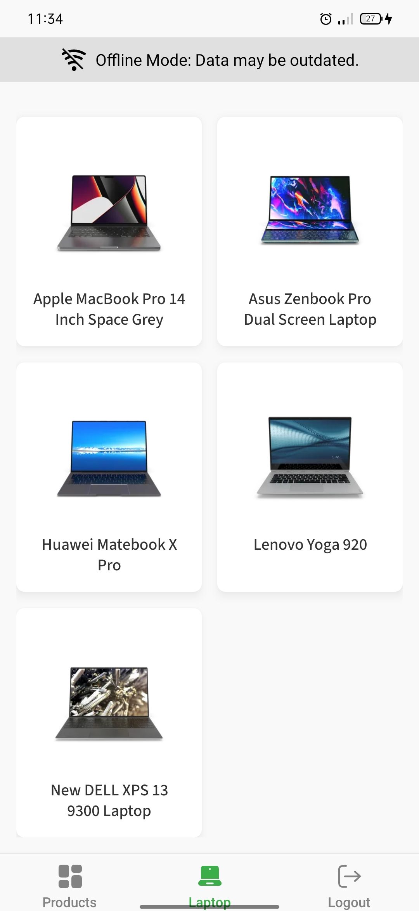
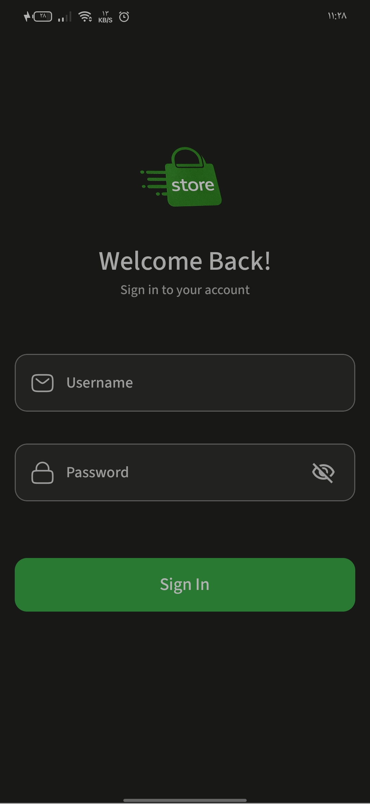
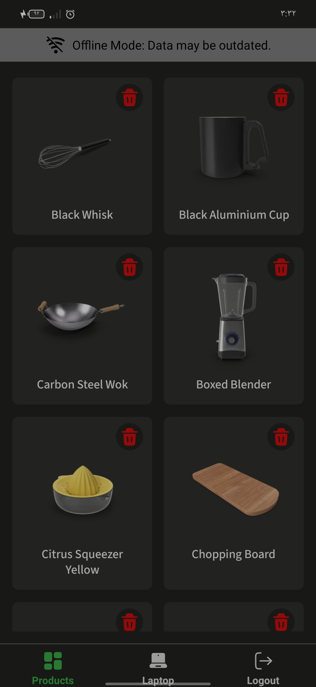
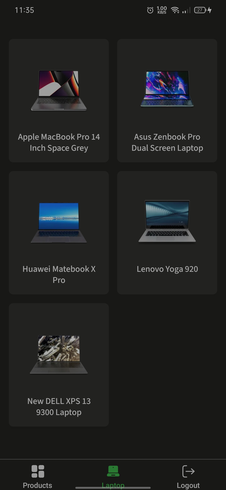

# Pages Store - React Native App

## Overview

This is a minimal React Native application.
The app demonstrates a simple e-commerce store with authentication, product listing, and offline persistence.
It uses DummyJSON as the backend API for authentication and product data.

### Key Features

- **Authentication**: Login via DummyJSON API with token storage and session validation
- **Auto-lock**: Locks after 10 seconds of inactivity or when the app goes to the background. Unlocks via biometrics (with password fallback)
- **Product Screens**: Displays all products and a filtered list for a specific category (Laptop)
- **Offline Support**: Persists React Query cache using MMKV for offline visibility on relaunch
- **Theme**: Light/dark theme depend on device theme

## Super-admin User Chosen

- **Username**: `noahh`
- **Password**: `noahhpass`

## Setup Steps and How to Run

### Prerequisites

- Node.js (v18+)
- Yarn or npm as package manager

### Installation

You can download the APK from here [Download APK](https://drive.google.com/file/d/1VvjnOm8_Iuut9ugQ6CINAT7GxR3rroHP/view?usp=sharing)

1. **Clone the Repository:**
   ```bash
   git clone https://github.com/MostafaHamdy3/E_Commerce_store
   cd E_Commerce_store
   ```

2. **Install Dependencies:**
   ```bash
   yarn install
   # or
   npm install
   ```

3. **Environment Configuration:**
   - Ensure device supports biometrics (tested on iOS/Android emulators with fallback)

### Running the App
   ```bash
   npx expo prebuild

   npm run android
   # or
   npm run ios
   ```

## 📱 Screenshots

<div align="center">

### App Interface - White




</div>

<div align="center">

### App Interface - Dark




</div>

## 📁 Project Structure

```
store_payIn/
├── assets/                   # Static assets
│   ├── bootsplash/           # Boot splash configurations
│   └── screenshots/          # App screenshots for README
├── src/
│   ├── assets/                     # App assets
│   ├── components/           # Reusable UI components
│   ├── hooks/                   # Custom React hooks
│   ├── navigation/              # Navigation configuration
│   ├── provider/                # Context providers
│   ├── screens/                 # Screen components
│   ├── services/                # API services and configurations
│   ├── store/                   # Redux store configuration
│   ├── theme/                   # Theme configuration
│   ├── types/                   # TypeScript type definitions
│   └── utils/                   # Utility functions
├── App.tsx                         # Main app component
├── index.ts                        # Entry point
├── package.json                 # Dependencies and scripts
├── tailwind.config.js           # TailwindCSS configuration
├── tsconfig.json                 # TypeScript configuration
└── README.md                    # Project documentation
```

## Trade-offs and Future Improvements

### If I Had More Time

- **Migrate from DummyJSON to Firebase Authentication**
  - Implement sign-up screen.
  - Implement proper OAuth providers (Google, Apple, Facebook).
  - Add email verification and password reset functionality.

- **Complete Category System**
  - Add dynamic category navigation or filtration with all available categories.
  - Add more details in product card.
  - Add detailed product page to show all product detail.

- **Shopping Cart & Checkout**
  - Implement shopping cart with persistent storage.
  - Using FlashList instead of FlatList.


## Tech Stack 🛠️

<div align="center">

| Category          | Technologies                                                                 |
|-------------------|-----------------------------------------------------------------------------|
| **Frontend**      |   |
| **Backend**       |  |
| **Navigation**    |  |
| **Data Fetching** |  |
| **Storage**       |  |
| **State Management** |  |
| **Validation**    |  |
| **Styling**       |  |

</div>

## Author 👨‍💻

<div align="center">

**Mostafa Hamdy**  
React Native | EXPO Developer - Software Engineering

[](https://mostafa7amdy.netlify.app/)
[](https://www.linkedin.com/in/mostafa-7amdy/)
[](mailto:mostafa44hamdy@gmail.com)

</div>
